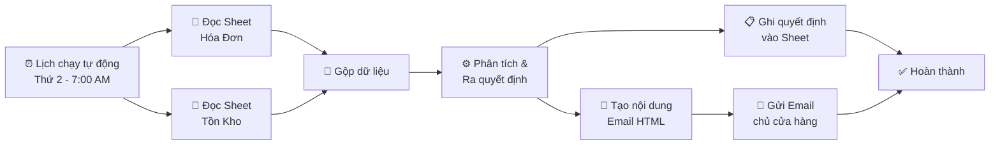

# 🏪 Hệ thống Tự động hóa Hỗ trợ Ra Quyết định Kinh doanh Bán lẻ
> **Retail Business Decision Support Automation System** | n8n · Excel · Power BI

---

## 📌 Overview

Dự án thiết kế và xây dựng hệ thống hỗ trợ ra quyết định tự động dành cho mô hình **cửa hàng tạp hóa bán lẻ**. Hệ thống tích hợp quy trình tự động hóa trên **n8n**, đọc dữ liệu giao dịch từ Excel, chạy thuật toán phân tích và đưa ra đề xuất nhập hàng tối ưu — toàn bộ được lên lịch chạy **7:00 sáng thứ Hai hàng tuần**, kết quả được ghi nhận hệ thống và gửi email thông báo tự động đến chủ cửa hàng.

---

## 📂 Dataset

- **Nguồn dữ liệu:** Hệ thống quản lý bán hàng thực tế của cửa hàng tạp hóa
- **Kỳ phân tích:** 01/05/2026 – 12/05/2026 (12 ngày giao dịch)
- **Quy mô:** 24 hóa đơn · 120 dòng giao dịch · 66 mặt hàng

| Sheet | Mô tả |
|---|---|
| `Hóa đơn` | Chi tiết giao dịch: mã đơn, thời gian, tên hàng, số lượng, đơn giá, thành tiền |
| `Tồn kho` | 67 mã hàng: giá nhập, giá bán, số lượng đã bán, tồn kho hiện tại |
| `Quyết định` | Output phân tích: phân loại 66 mặt hàng theo mức độ ưu tiên nhập hàng |

---

## ⚙️ System Architecture

---

## 🔍 Analysis Highlights

**Kết quả kinh doanh kỳ phân tích:**

| Chỉ tiêu | Giá trị |
|---|---|
| Tổng doanh thu | 6.005.500 đồng |
| Doanh thu trung bình / ngày | ~500.000 đồng |
| Biên lợi nhuận bình quân | 36,8% |
| Tổng lợi nhuận ước tính | 1.465.500 đồng |

**Phát hiện chính:**
- Thứ 2 và Chủ nhật là ngày cao điểm doanh thu; khung giờ 7–10h sáng bán chạy nhất
- 8 mặt hàng cần nhập gấp để tránh mất doanh thu
- Snack Poca đạt biên lợi nhuận 100% — cơ hội mở rộng danh mục

---

## 🧮 Decision Models

**1. Mô hình EOQ điều chỉnh** — Xác định lượng nhập hàng tối ưu dựa trên tốc độ bán, tồn kho hiện tại và chi phí nhập.

**2. Mô hình quyết định có trọng số** — Xếp hạng mặt hàng ưu tiên nhập theo các tiêu chí: biên lợi nhuận, tốc độ luân chuyển, mức tồn kho.

**Output:** Đề xuất nhập 8 mặt hàng ưu tiên, tổng giá trị **2.116.000 đồng**, dự kiến sinh lợi **674.000 đồng**.

---

## 🛠️ Tools & Technologies

- **n8n** — Lên lịch tự động (Thứ 2 / 7:00), đọc dữ liệu từ Google Sheets, chạy thuật toán phân tích, ghi kết quả và gửi email thông báo
- **Google Sheets** — Lưu trữ dữ liệu hóa đơn, tồn kho và kết quả quyết định nhập hàng
- **Gmail** — Gửi báo cáo đề xuất nhập hàng tự động đến chủ cửa hàng
- **Power BI** — Trực quan hóa doanh thu, lợi nhuận, phân tích sản phẩm

---

## 👤 Author

**Tô Lê Quỳnh Trang** · Mã SV: 23050656  
Lớp QH2023E-KTPT 6 — Trường Đại học Kinh tế, Đại học Quốc gia Hà Nội  
Học phần: Các Mô hình Ra Quyết định · Tháng 05/2025
